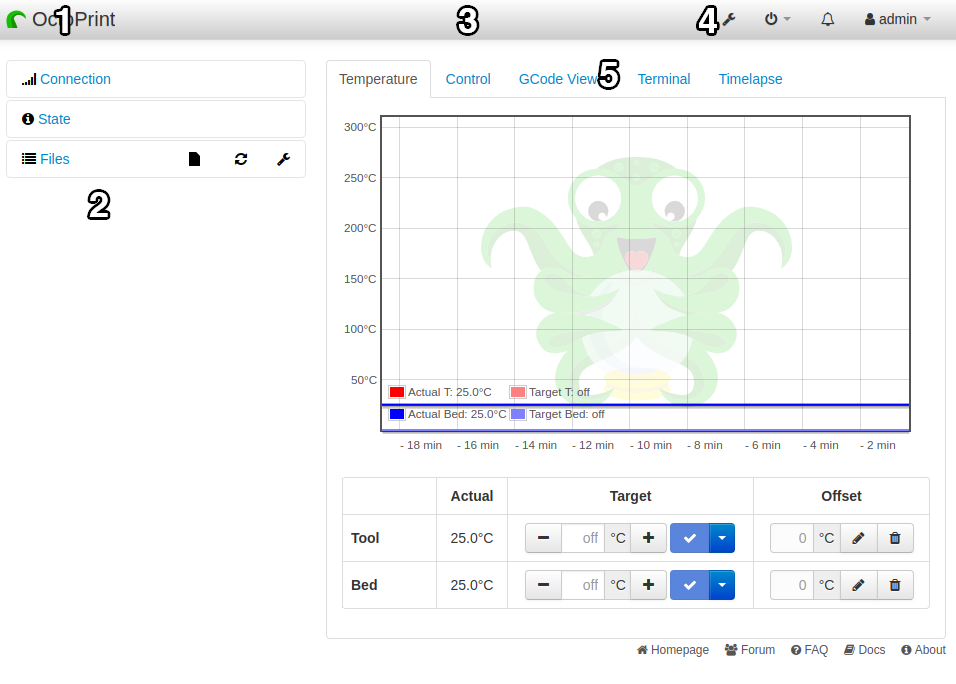
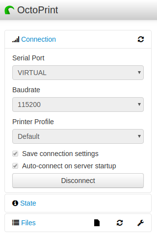
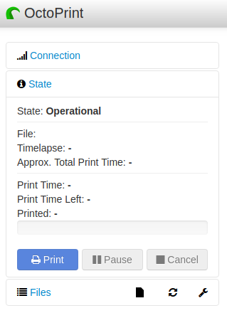
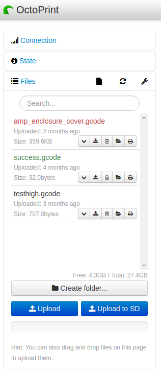
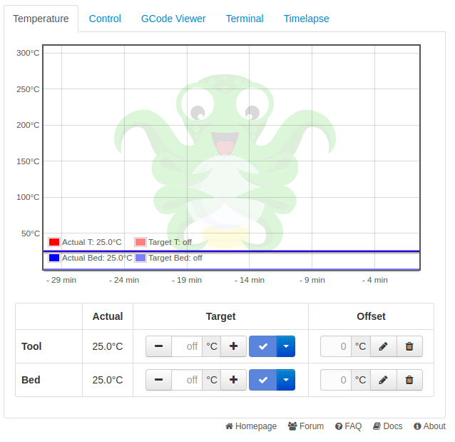
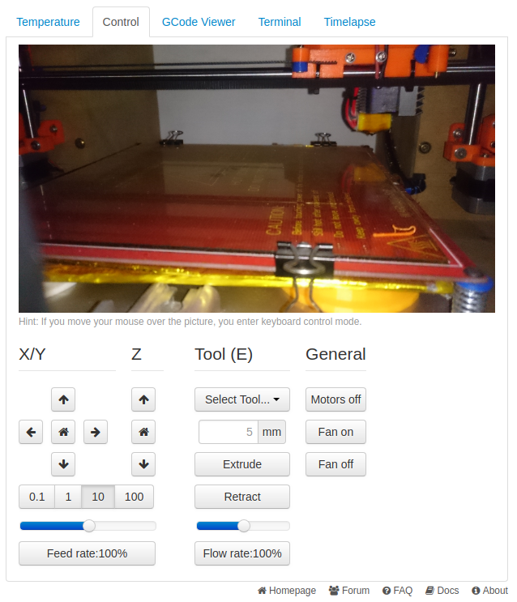
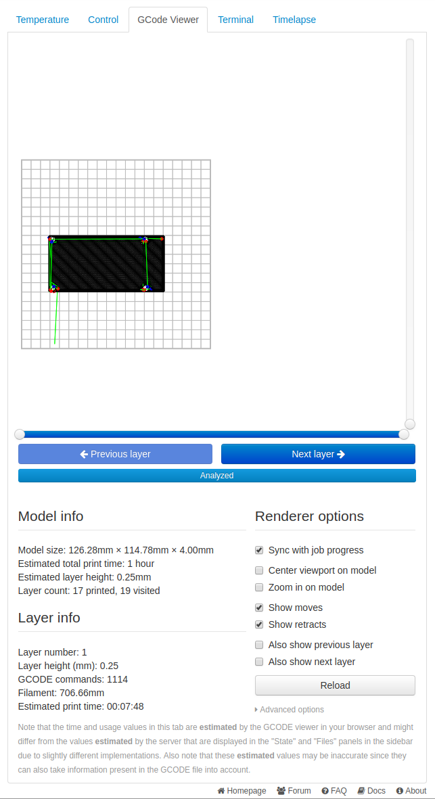
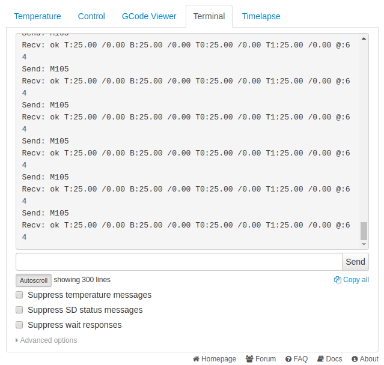
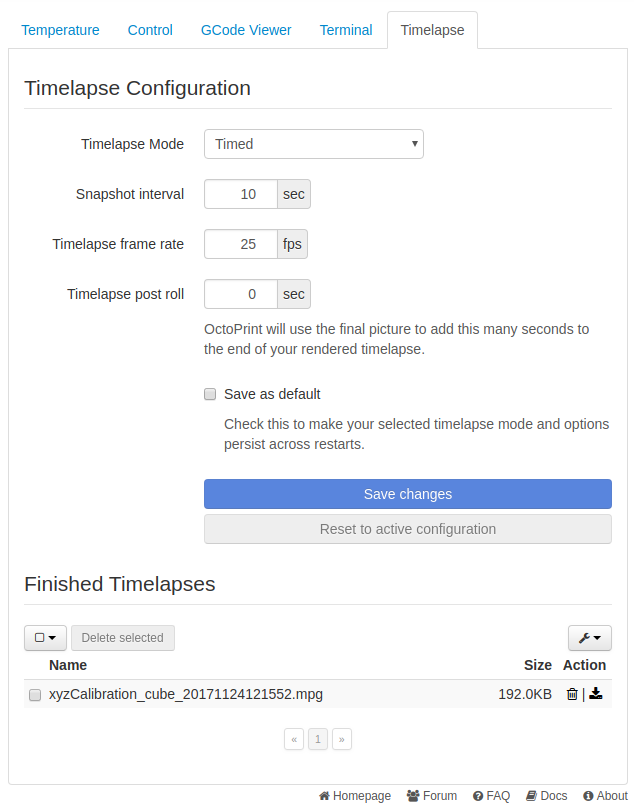

UI Overview
============

Main UI
-------

1. **Name**: You can set a name in OctoPrint's "Appearance" setting that will appear here to make it easier to identify if you have multiple OctoPrint devices.
2. **Side Bar**: This is where you will find printer connection settings, uploaded files, and the state of your printer's current job (if there is one).
3. **Nav bar plugins section**: This is where plugins can place themselves to display information.
4. **Nav bar menu**: From left to right - Settings - System menu - Notifications - Logged in user.
5. **Tabs**: The different tabs contain the various sections you can use to monitor and control your printer.

*The system menu is where you can find all the shutdown and restart options for OctoPrint and your server. Please ensure you always properly shut down your OctoPrint server, just turning it off may cause data corruption (especially if installed on a Linux operating system).*

*There are links down the very bottom of the page, under the tabs, to the documentation, the FAQ, discussion forum, and issue tracker. If you need help, check the FAQ, and the documentation, and if all else fails you can seek help on the discussion forum.*

---------------

Sidebar
-------

Connection
++++++++++

* **Serial Port**: The port your printer is connected to. On \*nix systems this may be /dev/ttyUSBx and on windows this would be COMx (where x is a number). In this screenshot we're connected to a virtual printer included with OctoPrint for development purposes. This does not reflect an actual connection to a real printer.
* **Baudrate**: This is the serial speed your printer's firmware expects to communicate at, this setting *must* match the setting in your printer's firmware. Typical values are 115200 and 250000. Additional entries can be added in OctoPrint's settings if your printer operates on a non-standard baud rate.
* **Printer Profile**: You can have multiple profiles for different printers, but only one printer and profile can be active at any given time for a  particular OctoPrint instance.
* **Save Connection Settings**: This will save the settings entered here upon a successful connection.
* **Auto-Connect On Startup**: This will have OctoPrint attempt to automatically connect to your printer as soon as it starts up.
* **Connect / Disconnect Button**: This button displays either ``Connect`` or ``Disconnect`` based on whether or not OctoPrint is connected to a printer. Clicking on this button will do as the currently displayed text suggests, either connect to a printer using the displayed settings, or disconnect from the currently connected device.

*Manually setting both the baud and port will result in the quickest and most reliable connecting during startup, if either are set to "Auto" it may take a significant amount of time before OctoPrint detects the correct settings.*

*Upon successful connection, the connection sidebar accordion will automatically collapse itself to save space.*

---------------

State
+++++

* **State**: Here's where you'll see the stus of your printer, Operational, Offline, Printing, etc...
* **File**: This will display the currently loaded file
* **Timelapse**: This will show the current timelapse mode setting, and interval if timed mode is active.
* **Approx. Total Print Time**: This is an estimated total print time of the currently loaded file based on a static analysis of the current file.
* **Print Time**: This is how long the current print job has been going for.
* **Print Time Left**: This is how long OctoPrint thinks is left on the current job, unlike the previous approximate estimation, this value is constantly re-calculated based on previous layers, previous successful prints of the same file, and other factors.
* **Printed**: How much of the current file has been printed.

*Note on print times: There are a lot of factors that can throw OctoPrint's estimation off. Maximum speed and acceleration set in your firmware can mean OctoPrint's estimates may be off by a few seconds, or a few days. Slicers that include print time estimates usually try to take your settings into account, OctoPrint is unable to do this since it is not slicing the files itself, and does not have access to these settings.*

* **Print, Pause, Cancel Buttons**: Control your prints with these.

*Pausing / Cancelling a print may not immediately stop the print (for example in the event you see your filament has run out) as your printer has a buffer inside it that it may have to run through before the print actually stops.*

---------------

Files
+++++

This is where your uploaded files will be displayed.

**Title bar icons**

* **SD Card Operations**: Refresh or release your SD card. This is the SD card attached directly to your printer.
* **Refresh**: Refresh the file list if for whatever reason an upload doesn't show up.
* **Settings**: Change various options for the file list such as sorting options and the types of files to display

**File name colour**

* **Red**: Print Failure, if a print fails or is cancelled the file's name will be displayed in red.
* **Green**: Print Success, if a print is completed 100% successfully, the file name will turn green.
* **Black**: This is the default file name colour for newly uploaded files that haven't been printed yet.

**File Buttons: Expand, Download, Delete, Load, Load and Print**

* **Expand**: Expands the file info to view extra info
* **Download**: Downloads the file to your local PC
* **Delete**: Delete the file from OctoPrint's storage
* **Load**: Loads the file, can be useful if you wish to view the file in OctoPrint's gcode viewer prior to printing.
* **Load and Print**: Loads the file and immediately starts printing. More useful if you slice on a PC and preview the gcode prior to uploading to OctoPrint.

**Operation Buttons**

* **Create Folder Button**: For creating a folder to store files in, for organising your files by project name or type, etc.
* **Upload Button**: This uploads your file to OctoPrint's server storage. This might be a spinning platter hard drive if OctoPrint is installed on a PC, or the SD card your Raspberry Pi OS is installed on.
* **Upload To SD Button**: This will attempt to upload your file to your printer's internal SD card if it has one.

*Upload to SD refers to the SD card that may be directly attached to your 3d printer via the LCD interface or standalone SD reader. This is NOT referring to the SD card a Raspberry Pi uses for its storage. Uploading to an SD card attached to your printer can be extremely slow.*

-----------

Tabs
-----

Most of the stuff in the tabs section is pretty well documented in the UI itself and it's fairly obvious what things do but here's a few things that might not be quite so obvious.

Temperature
+++++++++++

* **The Graph**: Shows a history of temperatures over time. Useful for seeing if your printer's temperatures fluctuate due to room temperature changes, cooling fans, etc, and whether your heaters can keep up or whether a PID tune is in order.
* **Controls**: This is where you can see and set your temperatures for the hot end and bed. An offset is also provided if you wish your hot end or bed to be hotter or colder than the temperatures set inside your gcode. This offset will be applied to gcode sent to your printer, and can be useful if you accidentally sliced something at 140℃ instead of 240℃.

*To turn off the hot end or bed heater, use the drop down menu and select* ``Off`` *or enter* ``0`` *(zero) for its temperature.*

-----------

Control
++++++++

**Webcam**

This is where you'll see a webcam feed if you have a web cam configured.

*Webcam images are supplied by a 3rd party program and are simply embedded here in the control tab. Webcam compatibility and capabilities depend on the webcam server, for a list of supported cameras under OctoPi's mjpg-streamer, see here:* https://github.com/foosel/OctoPrint/wiki/Webcams-known-to-work

**Movement**

* **The Arrow Buttons**: These do not indicate direction, but are representitive of positive and negative movement. The movement arrows that point "up" and "right" indicate positive movement, while the "down" and "left" pointing arrow buttons indicate negative movement. Pressing these buttons may cause your printer to move in what appears to be the opposite direction relative to the buttons. This is completely normal as long as your printer's axis moves in the positive direction when you press a positive movement direction button, and negative when you press the negative direction buttons. You can also invert these controls individually for X, Y, and Z in the printer profile in OctoPrint's settings if you wish.
* **House Icon**: The buttons with a little house icon is the "home" button and should cause your printer's axes to move towards the limit switches.
* **Distance Buttons**: These dictate how far the axis will move when you press the direction buttons. Measurements are in millimetres.
* **Feed Rate Slider + Button**: This will change the printer's movement speed multiplier. Useful for fine tuning your movement speed if you accidentally slice with a movement speed that is slightly too slow / fast.

**Tools**

* **Tool Selection**: If your printer has more than one tool head, you can select which one to control.
* **Extrude / Retract**: This will tell the printer to extrude or retract the amount of filament set.
* **Flow Rate Slider + Button**: You can use this if you observe your printer over or under extruding during a print. Ideally this value should always be left at 100%, if you need to change this for every print, you may need to re-calibrate your e-steps or slicer's extrusion rate multiplier.

*The feed rate and flow rate sliders do not synchronize across browsers and will reset to 100% on browser refresh. This is because most 3d printers don't output much in the way of information that OctoPrint can use to set these values in the UI, or to synchronize the value across sessions.*

**General**

* **Motors Off**: Sends the ``M18`` command to the printer to turn off the motors (if supported by your firmware)
* **Fan On/Off**: Turns the *parts cooling fan* on or off. This is the fan that cools down the plastic that comes out of your hot end. Any fan on your hot end's heatsink should never be turned off during a print.

*Firmware support for* ``M18`` *can differ, for example Repetier Firmware does not support* ``M18`` *but instead uses* ``M84`` *and so in some cases this  button may not function on your printer.*

----------------

Gcode Viewer
+++++++++++++

This will give you a top-down preview of the file that is currently loaded into OctoPrint. There's also some information listed about the file that is currently loaded.

*When the viewer is synced to a print job, the viewer may not display exactly what the printer is doing due to 3d printers containing a small buffer. The gcode viewer may be slightly ahead of what your printer is actually printing.*

------------

Terminal
++++++++

* **Console output**: This is where you can see the gcodes being sent to your printer, and any responses it may give back to OctoPrint. Mostly for diagnostic purposes in the case of errors and issues.
* **Entry box**: This is where you can enter manual gcode commands such as the command to start a PID auto tune, or to read / set EEPROM settings on your printer.
* **Filters**: Allows you to filter out certain terminal messages, for example print moves, to make looking for errors or certain messages more clear. More filters can be added in OctoPrint's settings.

*This is* **only** *the serial communication between OctoPrint and your printer. You cannot use it to perform command line operations such as those available through an SSH session.*

--------------

Timelapse
+++++++++

This is where you can set the mode (timed or z value based) to dictate how OctoPrint determines when to take each picture. Timed will take a picture every X seconds, On Z Change will take a photo every time the value of Z changes (so every new layer).

**Mode: Timed**

* **Interval**: Time between each snapshot when in timed mode
* **Framerate**: FPS of your final video
* **Timelapse post roll**: How many seconds OctoPrint will capture after your print is complete. This is handy so your video doesn't just suddenly stop immediately after the print is finished.

**Mode: On Z Change**

* **Minimum Interval**: Minimum time between snapshots to prevent "vase mode" prints from taking excessive amounts of images.
* **Retraction z-hop**: To differentiate between a Z hop for a travel movement on a single layer and an actual layer change, to prevent z-hops on travel movement from triggering a snapshot.

**Common**

* **Save as default**: This will write your configuration to OctoPrint's configuration file. Saving without this checked will only save the settings for the current session, rebooting OctoPrint will revert back to the previous settings. Saving with this checked will ensure OctoPrint always uses the settings as the defaults on startup.
* **Save changes button**: Saves the current settings (either temporary or as defaults if the option is checked to do so)
* **Reset to active configuration**: Reverts the current changes to the previously saved settings if you change something and wish to revert.

**Completed timelapses**

This is where you can manage your finished timelapse videos. You can download and delete them individually, or use the options to check all and mass delete them if you have a lot of old timelapse video you no longer wish to keep.
